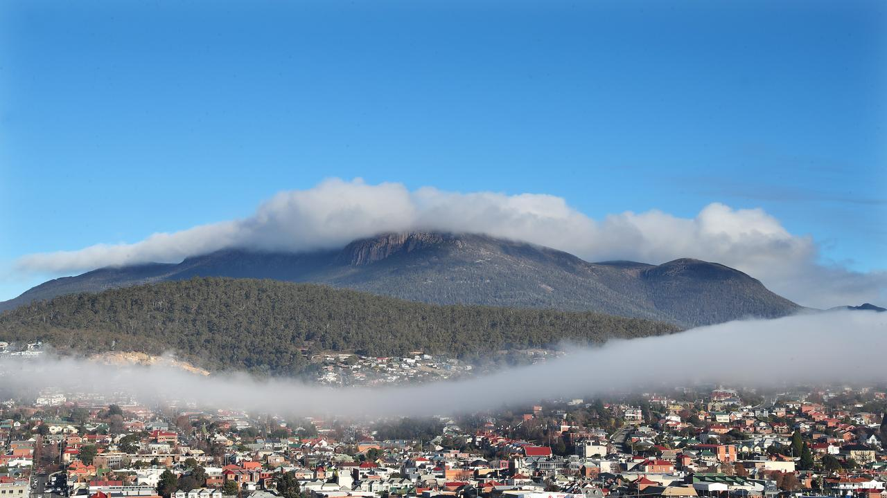
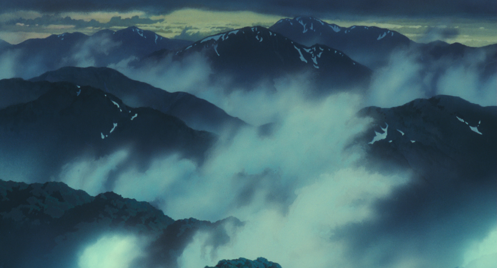

# Sphere2

I came up with this when I was maybe 17 on a family trip. One night I was having trouble sleeping and I had a lot of ideas to do with twilight and purpose. I have forgotten almost all of that, so I would like to use this idea that has been kicking around for far too long as a demo for some rendering techniques I find interesting. 

# Features To Do
## Technical
### World Generation
- [x] Hextile chunking
- [x] Defer chunking to worker thread
- [ ] Spread out chunk loading over frames
- [ ] Cache chunk data for later use
- [ ] Preempt which chunks will be needed before they're loaded and put in cache. (Compute slowly)
- [ ] Block far away chunks into 'megachunks' that can be rendered as a single mesh. (To reduce draw calls)
- [ ] Stitch the holes between chunks like this: https://www.youtube.com/watch?v=sXFxfqGPR-c
- [ ] Define biomes and terrain type attributes from noise CPU side. 
    - Geography (height / temperature, soil quality, lakeness) ->  (wind, humidity, greenness, wetness) -> 

### Control
- [ ] Fix the camera rotation issue that happens at one side of the sphere. Apparently hairy ball theorem.
https://gamedev.stackexchange.com/questions/73588/how-do-i-fix-my-planet-facing-camera
- [ ] Camera-player physics interacting with surface and walking properly

### Style
- [ ] Fog shader. This looks nice: https://www.youtube.com/watch?v=k1zGz55EqfU Would be good to have the fog not rise into the sphere to high, so that you can see across the sphere. Reminds me of looking into the sheet of fog over hobart

- [ ] Instanced grass blades with wind.  https://www.youtube.com/watch?v=Y0Ko0kvwfgA
    - Could default to rendering just speculars and shadows at a distance, taking the same input wind etc but rendering onto reduced or flat geometry.
- [ ] Perhaps ghibli painted style, especially for natural lumpy objects like trees and clouds. Interesting trick with taking the normals from a smooth underlying surface https://github.com/craftzdog/ghibli-style-shader/tree/main
https://www.youtube.com/watch?v=DEgzuMmJtu8